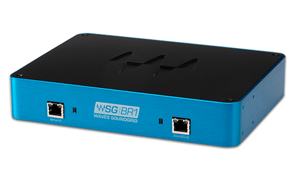

# TCP/IP basics 

---

## Agenda

* The layer model
* 2nd layer (IP)
* 3rd layer (TCP/UDP)
* Advance routing
* DNS

---

## OSI Layers model


---
### Basic principles:

* Every layer provide services to the one above her and consume services from the one below
* Every Layer communicate with the parallel layer in the responding host
* Lower layers are abstract, so every layer "feel" it talks with the peer layer
  directly.  

---

## TCP/IP 4 layers model
(It is a lay)

Layer | Function            | protocols
----- |:------------------- |:------------------
4     | Application level communication        | http/s ftp smtp ssl dhcp ssh
3     | Transportation      | TCP  UDP
2     | Internet            | IP (v4 and v6) ICMP
1     | Link                | MAC(Ethernet, wifi...)

Note:
An early architectural document, RFC 1122, emphasizes architectural principles over layering.[30] RFC 1122, titled Host Requirements, is structured in paragraphs referring to layers, but the document refers to many other architectural principles and does not emphasize layering. It loosely defines a four-layer model, with the layers having names, not numbers, as follows:
---
## phy
(Out of scope)



----
## Link Layer
(MAC layer)


----

### The Link
```bash
 ip link show
```

```
1: lo: <LOOPBACK,UP,LOWER_UP> mtu 65536 qdisc noqueue \
state UNKNOWN mode DEFAULT group default qlen 1000
    link/loopback 00:00:00:00:00:00 brd 00:00:00:00:00:00
```

```
2: wlp3s0: <BROADCAST,MULTICAST,UP,LOWER_UP> mtu 1500 \
qdisc fq_codel state UP mode DORMANT group default qlen 1000
    link/ether 98:5a:eb:8c:e5:3e brd ff:ff:ff:ff:ff:ff
```

```
3: virbr0: <NO-CARRIER,BROADCAST ,MULTICAST,UP> mtu 1500 \
qdisc noqueue state DOWN mode DEFAULT group default qlen 1000
    link/ether 52:54:00:62:33:42 brd ff:ff:ff:ff:ff:ff
```

```
4: virbr0-nic: <BROADCAST,MULTICAST> mtu 1500 qdisc fq_codel \
master virbr0 state DOWN mode DEFAULT group default qlen 1000
    link/ether 52:54:00:62:33:42 brd ff:ff:ff:ff:ff:ff
```
Note:
MAC address was originally burned into the physical device
Every vendor got a segment of addresses to ensure globally uniques

----
## ARP
### Address Resolution Protocol
Update the cache MAC-to-IP table
* Link receive packets addressed to its out MAC
and to `ff:ff:ff:ff:ff:ff` (all 1) - broadcast address
* Link can announce its oun IP address
Note:
Never routed outside the local network (So it is in the link layer)
----
## vlan


Note:
Only 4094 Networks available (12 bit tag minus 2 reserved addresses)
----
## 2nd layer IP protocol 


## 3rd layer and the TCP and  UDP protocol

